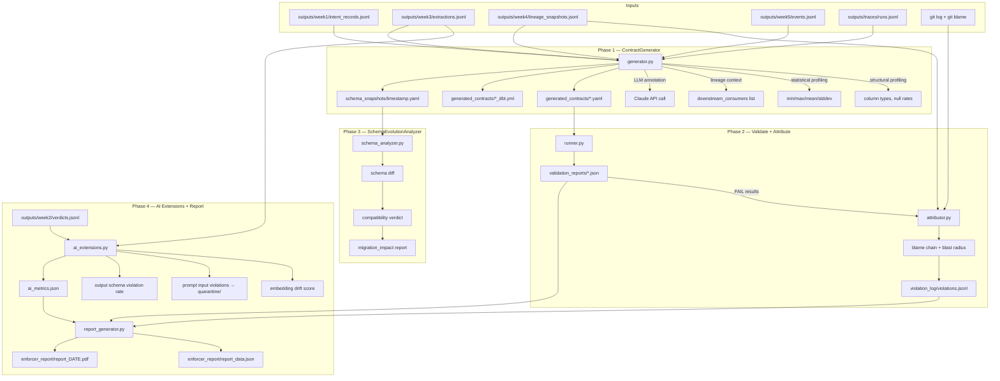
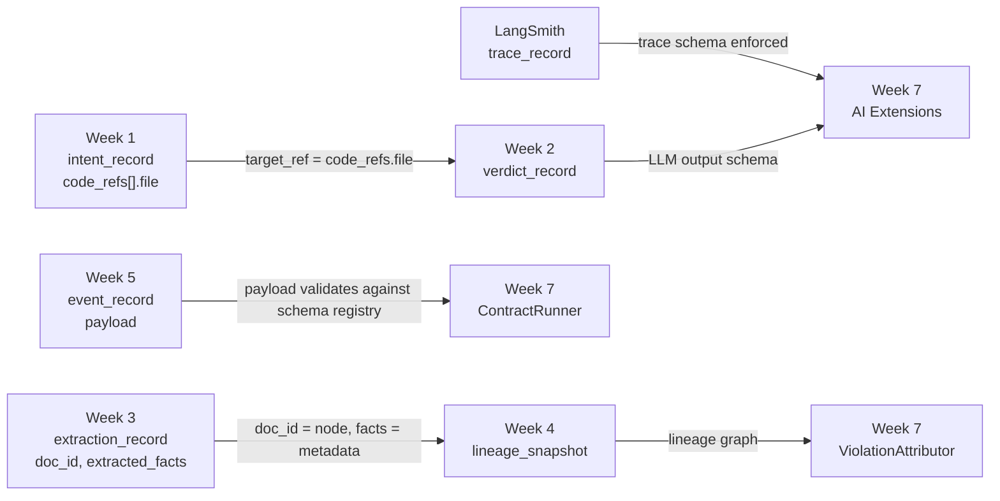
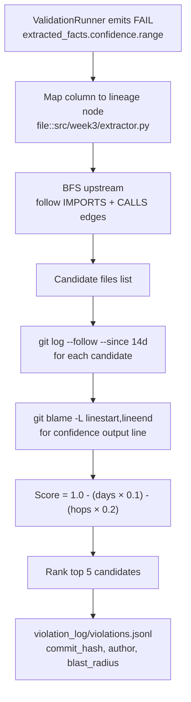
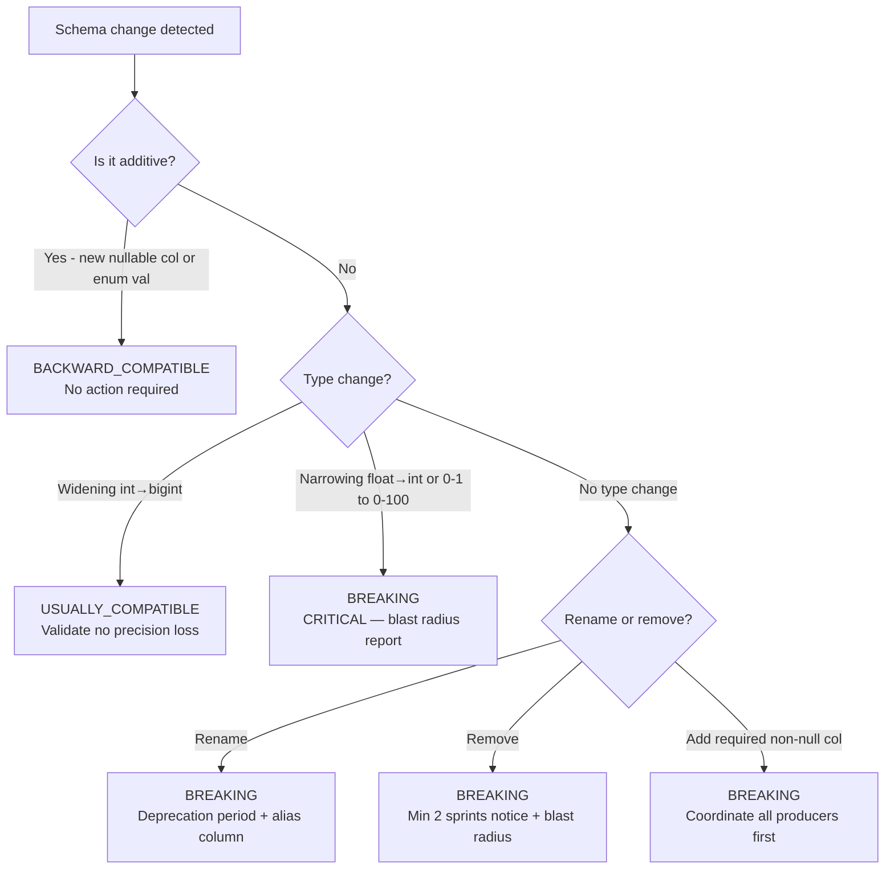

# data-contract-enforcer

A utility for generating and enforcing data contracts from JSONL datasets.

## Overview

This repository profiles extraction and event data to produce machine-checkable contract artifacts. It can generate contract YAML and schema snapshots from week-specific JSONL inputs, and includes logic to detect required fields, numeric ranges, enum values, UUID/date formats, and dataset-specific invariants.

## Quick start

1. Install dependencies:

   ```bash
   pip install -r requirements.txt
   ```

2. Generate contracts from a JSONL source file:

   ```bash
   python contracts/generator.py --source outputs/week3/extractions.jsonl --output generated_contracts
   ```

3. Review generated artifacts in `generated_contracts/`.

## Repository structure

- `contracts/` – contract generation and enforcement modules
- `generated_contracts/` – generated YAML contract artifacts
- `outputs/` – raw input JSONL datasets
- `schema_snapshots/` – timestamped schema snapshots
- `validation_reports/` – generated validation output
- `enforcer_report/` – report artifacts
- `violation_log/` – logged validation failures

## Notes

- `contracts/generator.py` profiles JSONL rows and writes contract clauses with type inference, required/optional status, numeric range rules, format detection, and low-cardinality enums.
- Ignore or regenerate generated outputs as needed when datasets or schema expectations change.

## Architecture

The repository is structured as a multi-phase pipeline that:

- generates data contracts from source JSONL, including structural, statistical, lineage, and AI-assisted profiling
- validates data against contract rules and attributes violations to code and ownership
- analyzes schema evolution for compatibility and migration impact
- produces AI-enabled reports and drift metrics

### Overall pipeline



### Data lineage and validation flow



### Violation attribution path



### Schema change decision tree


